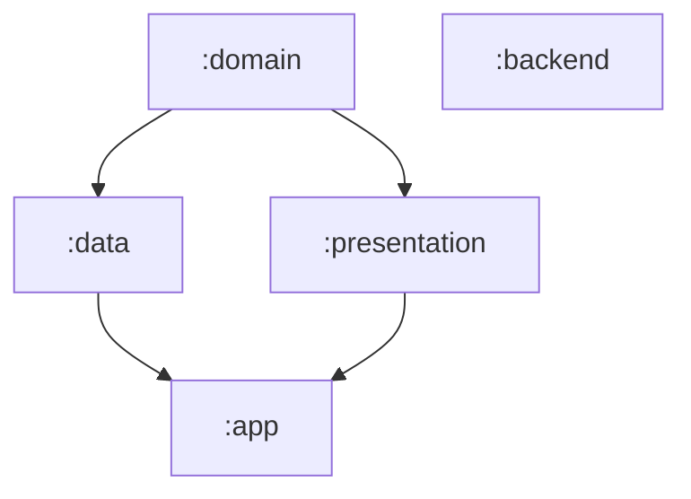

# Android App with Firebase cloud messaging and backend on Kotlin example

- Hilt
- Jetpack Compose
- Firebase cloud messaging
- Multimodule

```mermaid 
graph TD
:domain --> :data
:domain --> :presentation 
:data --> :app 
:presentation --> :app 
:backend 
```